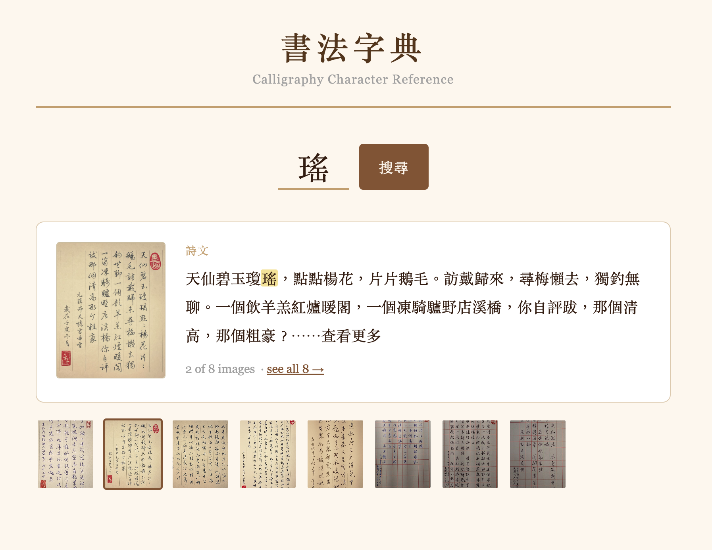

# 書法字典 Calligraphy Search

A Chinese calligraphy reference tool. Type a character, see how the calligrapher painted it — alongside the poem it came from.



## What it does

The app is built from a Facebook page dump of a calligrapher's posts. Each post contains a Chinese poem and a photo of the calligraphy. The tool extracts every character from every poem, indexes them, and lets you look up any character instantly.

- Search by Chinese character → see the calligraphy image
- Searched character is highlighted in the poem text
- Multiple images for the same character shown as thumbnails
- Click any image to view it full size

## Setup

**Requirements:** Python 3.9+

```bash
pip install -r requirements.txt
```

## Usage

**Step 1 — Parse the data** (run once, takes a few minutes)

```bash
python parser.py data/KobyCall.html
```

This reads the HTML dump, extracts ~670 posts and ~670 calligraphy images, and builds a SQLite database (`calligraphy.db`) with 2,950+ indexed characters.

**Step 2 — Start the server**

```bash
python server.py
```

Open [http://localhost:8000](http://localhost:8000) in your browser.

## Adding more data

Drop additional HTML dumps into `data/` and run the parser again:

```bash
python parser.py data/NewFile.html
```

New posts are appended to the existing database.

## Running tests

```bash
pytest
```

## Project structure

```
parser.py        — one-time HTML extraction script
server.py        — FastAPI web server
db.py            — SQLite schema and connection helper
data/            — source HTML dumps (not committed)
images/          — extracted JPEG files (not committed)
static/          — web UI
tests/           — test suite (25 tests)
```

## Tech stack

Python · FastAPI · BeautifulSoup4 · SQLite · Vanilla JS
